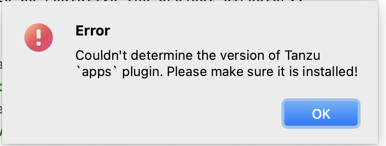

# TAP Monolith Instructions

TAP for a single application

<details close>
<summary>How to setup the Environment</summary>

## Setup

### Install the following:

- kubectl

    - try `kubectl version`
    - if command is not found then install from https://kubernetes.io/docs/tasks/tools/#kubectl
    - try `kubectl version` and if not the correct version then might need to also
      ```
      brew list kubectl  # copy the first line from the output
      ln -s -F /opt/homebrew/Cellar/kubernetes-cli/1.29.0/bin/kubectl `which kubectl`
      ```
- tanzu-cli

  - try `tanzu version`
  - if command is not found then
    
    - install the cli and plugins from https://docs.vmware.com/en/VMware-Tanzu-Application-Platform/1.7/tap/install-tanzu-cli.html#install-or-update-the-tanzu-cli-and-plugins-3
    - For tanzu cli plugins:
 
      `tanzu plugin group search --show-details`

      Look for 'Plugins for TAP' and get the latest version

      For example the version number is `v1.7.2` then the command is:

      `tanzu plugin install --group vmware-tap/default:v1.7.2`

      That will get all the tanzu plugins that are needed.
    - Enable tanzu autocomplete

      - `tanzu completion zsh > ~/.tanzu-complete.zsh`
      - edit ~/.zshrc and add
      ```
      autoload -U +X compinit && compinit
      source $HOME/.tanzu-complete.zsh
      ```
      - `source ~/.zshrc`
  - try `tanzu version`
  
- Tilt
  - try `tilt version`
  - if command is not found then

    - install tilt from https://docs.tilt.dev/install.html
  - try `tilt version`

- TAP workspace (good only for 8 hours)
    
  - get a TAP workspace using https://tanzu.academy/guides/developer-sandbox
  - follow the directions for **Kubernetes Configuration** and copy the files into the '~/.kube' directory
  - follow the directions for **Cleanup** and copy the file into the '~/.kube' directory
  - `chmod +x ~/.kube/*.sh`
  - `~/.kube/set-context.sh`

  - Install the tanzu cli plugins from https://docs.vmware.com/en/VMware-Tanzu-Application-Platform/1.5/tap/cli-plugins-apps-tutorials.html

  - follow the directions for **IDE Configuration** and copy the file into the 'kube' directory
  - Intellij plugins `Settings -> Plugins`
    - search for 'tanzu' and install 'Tanzu Developer Tools'
    - Follow the steps listed at https://docs.vmware.com/en/VMware-Tanzu-Application-Platform/1.7/tap/application-accelerator-intellij.html to install the Application Accelerator plugin~~
      - might not be obvious that you select the file and have to click apply to see the plugin in the list of installed plugins.
      - Even less obvious is that you need copy the link to the 'Tanzu Developer Portal' from either page 1 or 2 of the Tap Sanbox left hand instructions.
      - Configuration `Settings -> Tanzu Application Accelerator` and paste in that URL.

</details>

<details close>
<summary>Tanzu Development Tools Plugin Error?</summary>
if you see:



Intellij idea started from the Mac OS dock does not have an environment so the plugin cannot find the `tanzu` cli.

### Fixing Intellij Idea not having an environment on Mac OS
- Install the Intellij idea command launcher (Tools -> Create Command-Line Launcher...)
- You need to location of the launcher (`which idea`)
- Use the `Automator` to create an 'Application' that is a 'Run Shell Script'

  Here is my script:
  ```
  source $HOME/.zshrc
  /usr/local/bin/idea
  ```
  Since I use zsh I used that for the shell and initialized the shell from my .zshrc
- Save that in 'Application' as 'Intellij Idea with Env.app'
- Right click on 'Intellij Idea with Env.app' to 'Get Info' and drag the Original Intellij Idea.app to the icon at the top left corner so it looks like Intellij Idea
- Drag 'Intellij Idea With Env.app' to the Dock

Now when Intellij is started from the Dock it will have an environment.
</details>
<details close>
<summary> Restarting? Is the TAP Workspace config current?</summary>
- follow the directions from the TAP workspace for **Kubernetes Configuration** and copy the files into the '~/.kube' directory
- `chmod +x ~/.kube/*.sh`
- `~/.kube/set-context.sh`
- Copy the link to the 'Tanzu Developer Portal' from either page 1 or 2 of the Tap Workspace left hand instructions.
  
  Configuration `Settings -> Tanzu Application Accelerator` and paste in that URL.
</details>

# Create the basic web app
~~Refer to the TAP Developer Sandbox for the 'Deploy App: Command Line' to generate basic web app source code.~~

~~Instead of using the '--options' shown on the sandbox use '--options-file accelerator-config.json'~~
~~After unzipping the tanzu-java-web-app.zip we need to copy all the files into this directory~~
~~`cp -R -n tanzu-java-web-app/* .`~~
~~`cp -R -n tanzu-java-web-app/.* .`~~
~~`cp tanzu-java-web-app/README.md tanzu-README.md`~~
~~`rm -rf tanzu-java-web-app tanzu-java-web-app.zip`~~

Create a new Intellij Idea project "File -> New -> Project..." Select the 'Tanzu Application Accelerator'

In the Tanzu Application Accelerator find the "Tanzu Java Web App" in the list

Select it and click 'Next'.

Enter the 'Project Location' the folder where the project folder will be created.

Select:
- 'Gradle' as the Build tool
- 'intellij' for the IDE
- Spring Boot Version '3.1'
- Jave Version '17'
and click 'Next'

Enter your repository information OR git init in the new project....

click 'Next'

click 'Next'

Wait until the zip has been down loaded

click 'Create'

Open in a new Intellij Window.

In that new Intellij Window:

Use the Terminal to start tilt `tilt up`

In the 'Project' view right click on the workload.yaml file and at the bottom of the menu
find 'Tanzu' and in the submenu click 'Apply Workload'

**NOTE:** Avoid starting the workload from the command line since the Tanzu Development Tools Plugin does not fully
work with a workload started that way.

There will be lots of messages as the workload is started and eventually
the tanzu-panel will show the running workload.

From the tanzu-panel expand the 'Running Application' and right click and describe the application
so that you can find the 'URL' (Not the Address: URL)

To get the application logs keep expanding until the pod is shown and right click and 'Show Logs'

# Enable Debug
To debug using the Tanzu Panel expand the workload and right click on 'Debug Workload'

TODO - add Actuators